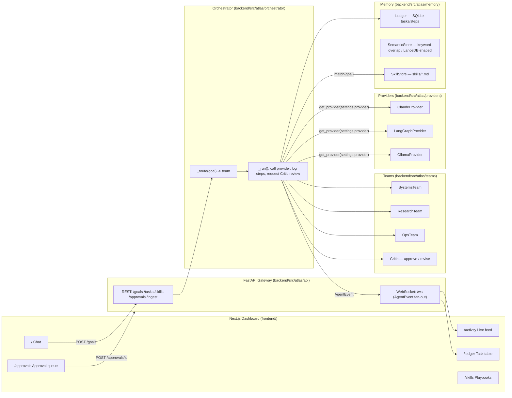

# ATLAS — Autonomous Task & Lab Assistant System

> A multi-team, multi-provider agent system: an orchestrator decomposes goals, routes them
> to specialist teams, verifies the result with a Critic before marking anything done, and
> compounds what it learns into versioned procedural memory. A Next.js dashboard streams
> every step live.

[](https://github.com/harshitwandhare/atlas-ra/actions/workflows/ci.yml)


## Why ATLAS exists

Frontier agents are powerful but stateless and unaccountable. ATLAS wraps a model-agnostic
agent core in the engineering that makes autonomy trustworthy:

- **Multi-team orchestration** — the `Orchestrator` keyword-routes each goal to a team
  (`systems`, `research`, `ops`), runs it against the configured provider, and retries with
  reviewer feedback on failure.
- **Three-tier memory** — episodic (SQLite task ledger), semantic (keyword-overlap store
  today, LanceDB-shaped interface for a drop-in vector backend), and procedural (versioned
  markdown skill playbooks matched by trigger keywords).
- **Tiered, approval-gated execution** — tools declare a tier (API → CLI → browser → screen)
  and a risk class; `destructive`-risk tools are routed through an `ApprovalQueue` and never
  execute without a human decision from the dashboard.
- **Verification before completion** — a `Critic` reviews the run transcript and returns
  `approve` / `revise`; the orchestrator only marks a task `DONE` on approval.
- **Provider abstraction** — `AgentProvider` is a `Protocol` with three implementations
  (Claude Agent SDK, LangGraph, Ollama) selected at runtime via `ATLAS_PROVIDER`.
- **Live observability** — every normalized `AgentEvent` is persisted to the ledger, wrapped
  in an OpenTelemetry span, and fanned out over WebSocket to the dashboard.

## Architecture



See [docs/ARCHITECTURE.md](docs/ARCHITECTURE.md) for the full task lifecycle, memory
read/write paths, and execution-tier policy, and [docs/DATA_MODELS.md](docs/DATA_MODELS.md)
for every data model in the system. Design rationale lives in [docs/adr/](docs/adr/).

## Module map

Verified against source — nothing here is aspirational.

| Module | What it actually does |
|---|---|
| `atlas.orchestrator.core` | `Orchestrator`: creates a task in the ledger, keyword-routes it to a team, runs the provider loop, retries on failure (`settings.max_retries`), requests Critic review, transitions task state. |
| `atlas.providers.base` | `AgentProvider` protocol — `run(task_id, system_prompt, goal, tools, context) -> AsyncIterator[AgentEvent]`. The only surface the rest of the system may depend on. |
| `atlas.providers.claude` | Reference provider wrapping `claude_agent_sdk.query()`; normalizes SDK message blocks into `MESSAGE_DELTA` / `TOOL_CALL` events. |
| `atlas.providers.langgraph` | Builds a `langgraph.prebuilt.create_react_agent` graph; optional dependency, imported lazily. |
| `atlas.providers.ollama` | Zero-dependency HTTP client against a local Ollama server (`/api/generate`); non-streaming. |
| `atlas.providers.registry` | `get_provider(name)` — string-keyed lookup selected via `ATLAS_PROVIDER` config. |
| `atlas.teams.systems` / `.research` / `.ops` | Static system prompts + declared tool/tier/risk lists per team. No team-specific Python logic beyond the prompt. |
| `atlas.teams.critic` | `Critic.review(goal, transcript)` — heuristic reviewer today (rejects empty transcripts and transcripts ending in "error"); interface is provider-swappable. |
| `atlas.memory.episodic` | `Ledger` — SQLite-backed `tasks` / `steps` tables; `create_task`, `set_state`, `log_step`, `get_task`, `list_tasks`. |
| `atlas.memory.semantic` | `SemanticStore` — JSONL-backed keyword-overlap search (`Doc`, `add`, `search`); same interface a LanceDB backend would implement. |
| `atlas.memory.procedural` | `SkillStore` — parses front-matter markdown in `skills/*.md` into `Skill` objects; `match(goal)` returns skills whose triggers substring-match the goal. |
| `atlas.executors.registry` | `ToolRegistry` + `Tool` dataclass (name, tier, risk, handler). `execute()` routes `Risk.DESTRUCTIVE` tools through an `ApprovalQueue` before running the handler. Ships `run_python`, `run_powershell`, `delete_path`. |
| `atlas.executors.approvals` | `ApprovalQueue` — in-process pending/approved/denied request store with `asyncio.Event`-based waiting and an optional notifier callback. |
| `atlas.comms.email_adapter` | `EmailAdapter` protocol + `ImapAdapter` reference implementation (IMAP fetch, SMTP send, credentials via `keyring`). |
| `atlas.comms.email_watcher` | `EmailWatcher` — regex-based action-item extraction from unread mail; `send_reply()` always parks the draft in `ApprovalQueue` before `adapter.send()` — no direct-send path exists in code. |
| `atlas.comms.notify` | `TelegramNotifier` — fire-and-forget Telegram `sendMessage` call, swallows failures so notification errors never break the pipeline. |
| `atlas.ingest.pipeline` | `ingest(source, store)` — format-dispatch table (`.pdf`, `.pptx`, `.docx`, `.txt/.md/.srt/.vtt`) plus `fetch_video_transcript()` via `yt-dlp`; degrades to an "install X" string when an optional dependency is missing. |
| `atlas.ingest.procedures` | `extract_procedure(text)` — regex-based imperative-sentence extractor that turns a transcript into a draft skill playbook (never auto-promoted). |
| `atlas.observability.tracing` | `traced_event()` context manager — wraps each event in an OpenTelemetry span, no-ops if the SDK isn't configured. |
| `atlas.api.main` | FastAPI app: `POST /goals`, `GET/POST /tasks`, `GET /skills`, `GET/POST /approvals`, `POST /ingest`, `WS /ws`. `Bus` fans out `AgentEvent`s to connected dashboard clients. |
| `atlas.cli` | Typer CLI: `atlas serve` (runs the FastAPI app via uvicorn), `atlas version`. |
| `frontend/app/page.tsx` | Chat view — submits a goal via `POST /goals`, filters the live WebSocket event stream to that task. |
| `frontend/app/activity/page.tsx` | Raw live event feed (all tasks) from `useEvents()`. |
| `frontend/app/ledger/page.tsx` | Polls `GET /tasks` every 3s, renders the task table with state coloring. |
| `frontend/app/skills/page.tsx` | Renders `GET /skills` as playbook cards. |
| `frontend/app/approvals/page.tsx` | Polls `GET /approvals` every 2.5s; Approve/Deny buttons call `POST /approvals/{id}`. |
| `frontend/lib/api.ts` | Typed fetch wrappers + shared `Task` / `AgentEvent` / `Skill` interfaces. |
| `frontend/lib/useEvents.ts` | WebSocket hook with exponential-backoff reconnect, keeps the last N events. |

## Quickstart

```bash
# Backend — Python 3.10+, uv (or plain venv + pip)
cd backend
uv sync --all-extras                 # or: python -m venv .venv && pip install -e ".[dev]"
cp .env.example .env                 # set ANTHROPIC_API_KEY / ATLAS_PROVIDER etc.
uv run atlas serve                   # FastAPI + orchestrator on :8000

# Frontend — Node 20
cd ../frontend
npm install
npm run dev                          # dashboard on :3000
```

Run the test suite and evals the same way CI does:

```bash
cd backend
uv run ruff check .
uv run mypy src
uv run pytest -q
uv run python -m evals.run_evals
```

## CI / quality gates

`.github/workflows/ci.yml` runs on every push and pull request to `main`, with pip (uv)
and npm dependency caching:

| Job | Steps |
|---|---|
| `backend` | `ruff check` → `mypy --strict` → `pytest` → `evals.run_evals` (scored regression tasks in `backend/evals/`, results tracked in `backend/evals/results.jsonl`) |
| `frontend` | `npm ci` → `next lint` → `next build` |

`.github/workflows/deploy.yml` deploys `frontend/` to Vercel on push to `main` (gated
behind `VERCEL_TOKEN` / `VERCEL_ORG_ID` / `VERCEL_PROJECT_ID` repo secrets — see the
workflow file for one-time setup notes).

## Tech stack

| Layer | Choice |
|---|---|
| Backend framework | FastAPI + uvicorn, Pydantic v2 / pydantic-settings |
| Agent runtime | Claude Agent SDK (reference), LangGraph, Ollama — behind `AgentProvider` |
| Episodic memory | SQLite (stdlib `sqlite3`) |
| Semantic memory | Keyword-overlap store (JSONL); LanceDB-shaped interface |
| Procedural memory | Git-versioned markdown in `skills/`, front-matter parsed |
| Observability | OpenTelemetry API/SDK, optional OTLP export |
| Package/lint/type | uv, ruff, mypy (strict) |
| Testing | pytest, pytest-asyncio |
| Frontend | Next.js 14 (App Router), TypeScript, Tailwind CSS |
| Realtime | Native WebSocket (`/ws`), reconnect with backoff |
| CI/CD | GitHub Actions (`ci.yml`, `deploy.yml`), Vercel |

## Repository layout

```
backend/    Typed Python package (uv, ruff, mypy, pytest) — orchestrator, providers,
            teams, memory, executors, comms, ingest, api
frontend/   Next.js 14 dashboard (App Router, Tailwind, WebSocket client), Storybook
skills/     Procedural memory — versioned playbooks the system learns and uses
docs/       Architecture, data models, ADRs, roadmap
```

## Safety model

Destructive actions (file deletion, system changes, outbound email) are declared with
`Risk.DESTRUCTIVE` in the tool registry and are enforced — in code, not just prompting —
to route through `ApprovalQueue` before executing. All task steps are logged to the
episodic ledger (SQLite) for audit. Secrets are read from environment / OS keyring,
never committed (`backend/.env.example` documents the required variables; `.env` is
git-ignored).

## License

MIT © Harshit Wandhare
