<div align="center">
  <picture>
    <source media="(prefers-color-scheme: dark)" srcset="assets/logo-dark.svg">
    
  </picture>
</div>

# ATLAS: Autonomous Task & Lab Assistant System

> A multi-team, multi-provider agent system: an orchestrator decomposes goals, routes them
> to specialist teams, verifies the result with a Critic before marking anything done, and
> compounds what it learns into versioned procedural memory. A Next.js dashboard streams
> every step live.

[](https://github.com/harshitwandhare/atlas-ra/actions/workflows/ci.yml)
[](https://github.com/harshitwandhare/atlas-ra/actions/workflows/codeql.yml)
[](https://securityscorecards.dev/viewer/?uri=github.com/harshitwandhare/atlas-ra)


[](https://github.com/astral-sh/ruff)
[](https://github.com/astral-sh/uv)
[](https://conventionalcommits.org)


## Try it

**[atlas-ra.vercel.app](https://atlas-ra.vercel.app)**: the landing page explains the
system end to end, and the dashboard is browsable at
[`/console`](https://atlas-ra.vercel.app/console).

[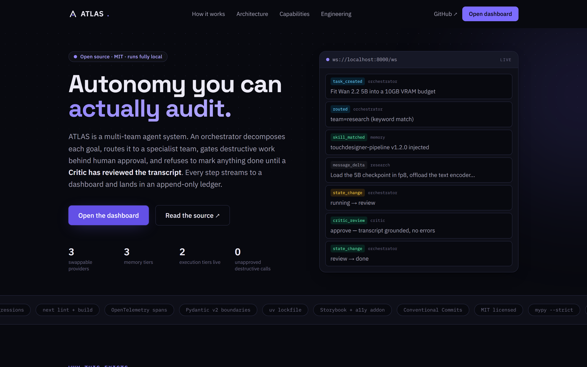](https://atlas-ra.vercel.app)

ATLAS runs on your own machine, so the deployment has no backend attached. The dashboard
detects that and serves illustrative sample data behind a notice saying so. Nothing there
is a live run.

The hosted page cannot reach a backend on your machine either: browsers block an `https`
origin from calling `http://localhost`, and the API only allows `http://localhost:3000` as
a CORS origin. Run the dashboard locally (`npm run dev`) alongside `atlas serve` and it
picks up your real data with no configuration change.

<details>
<summary><b>More of the site</b>: task lifecycle, architecture, and the dashboard in preview mode</summary>

<br>

| Five checkpoints before a task counts as done | Six layers, one replaceable seam |
|---|---|
| [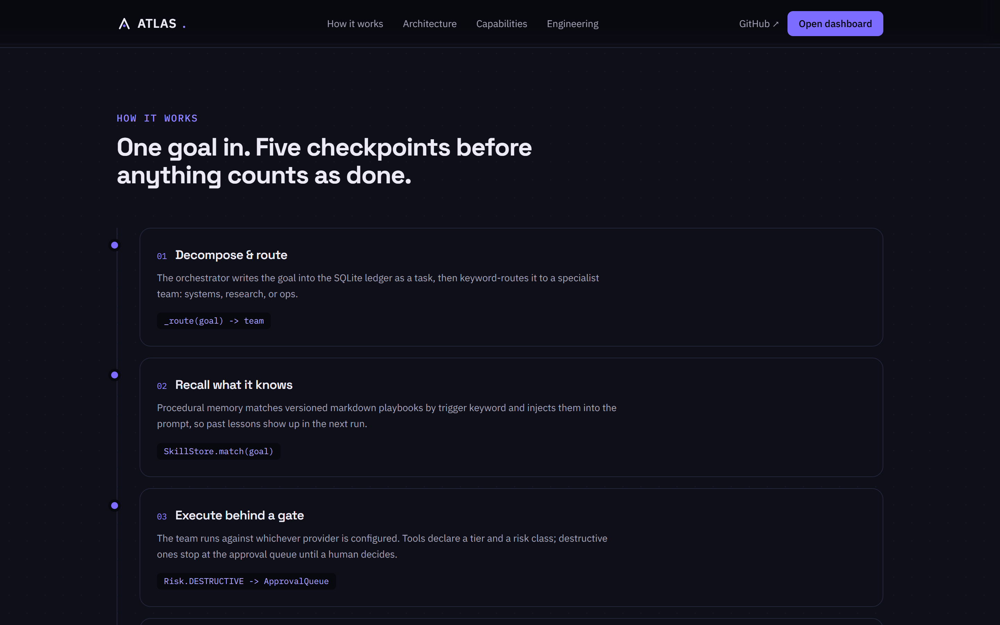](docs/screenshots/preview/lifecycle.png) | [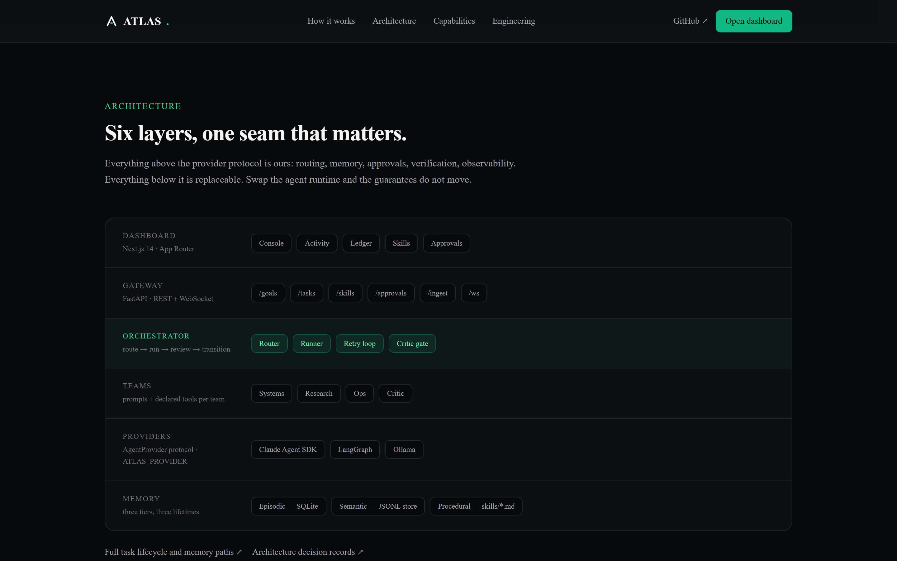](docs/screenshots/preview/architecture.png) |

| Console: goal submission | Ledger: every task, filterable by state |
|---|---|
| [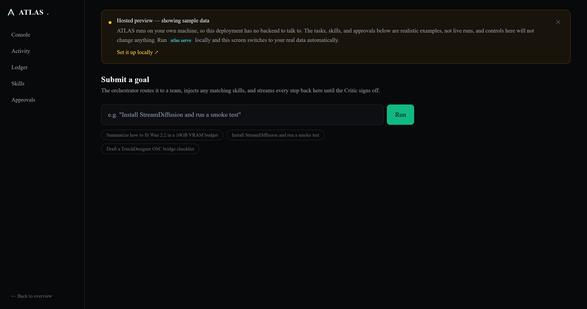](docs/screenshots/preview/console.png) | [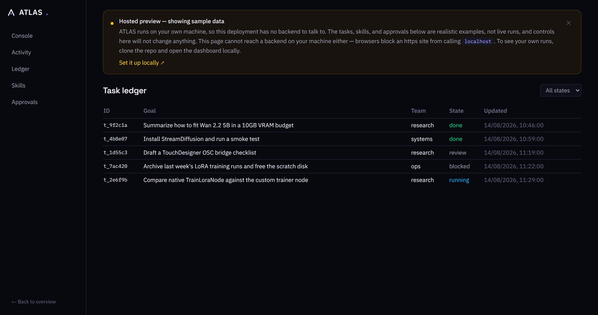](docs/screenshots/preview/ledger.png) |

| Approvals: destructive work waits here | Skills: versioned procedural memory |
|---|---|
| [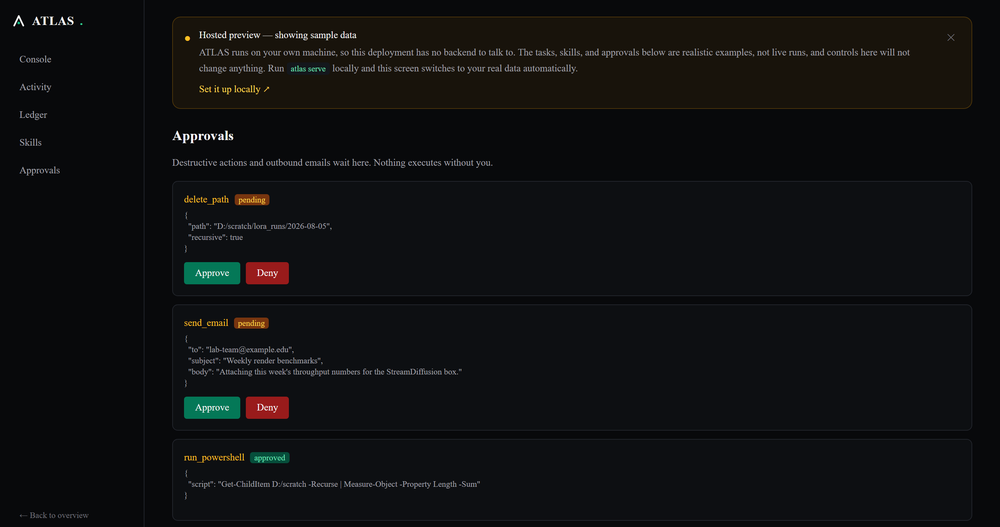](docs/screenshots/preview/approvals.png) | [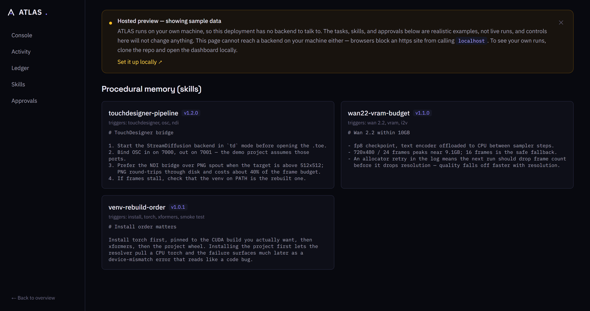](docs/screenshots/preview/skills.png) |

These are captures of the hosted preview, so the data in them is illustrative. The
screenshots below are of real runs. Regenerate this set with:

```bash
uv run python scripts/capture_screens.py
```

</details>

## Live on a real workstation

Real screenshots of an ATLAS instance on a Windows box running fully local
(`ATLAS_PROVIDER=ollama`, `llama3.2:3b`, zero cloud calls): goals routed to the
research team, skills injected from procedural memory, critic-reviewed, ledgered.

| Ledger: completed runs | Live activity: critic retry loop |
|---|---|
| 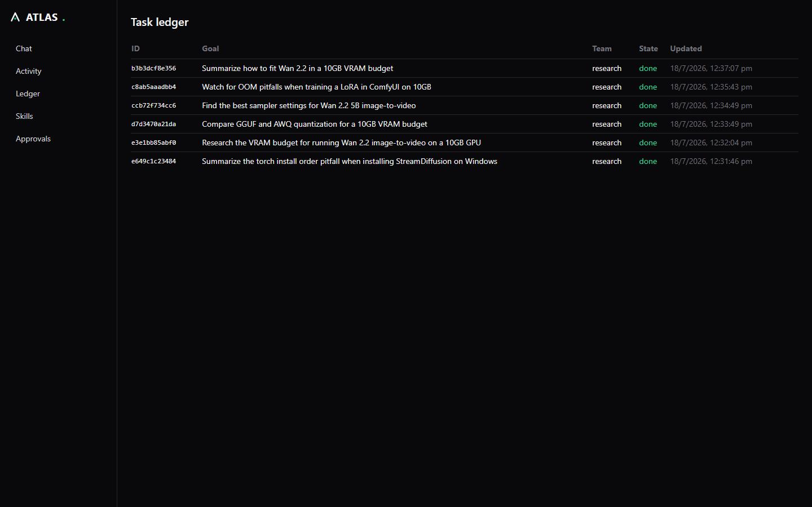 | 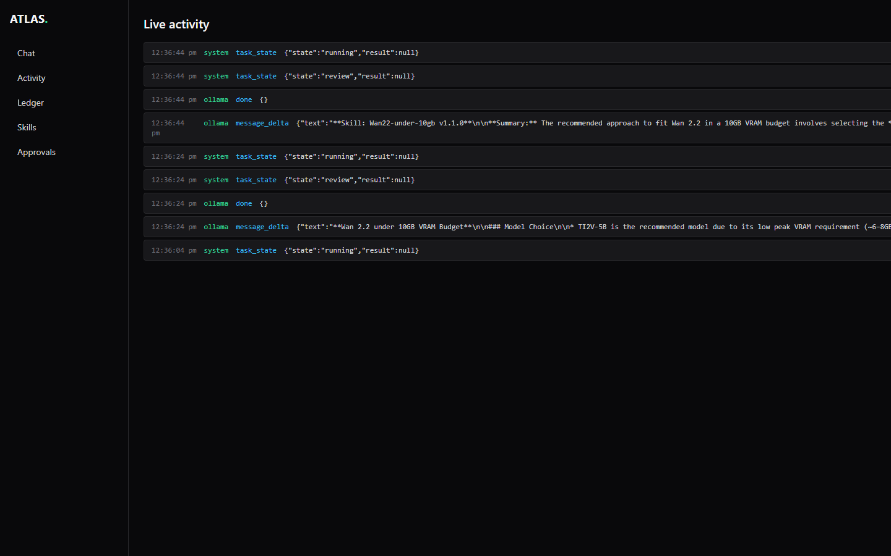 |

| Procedural memory | Goal submission |
|---|---|
| 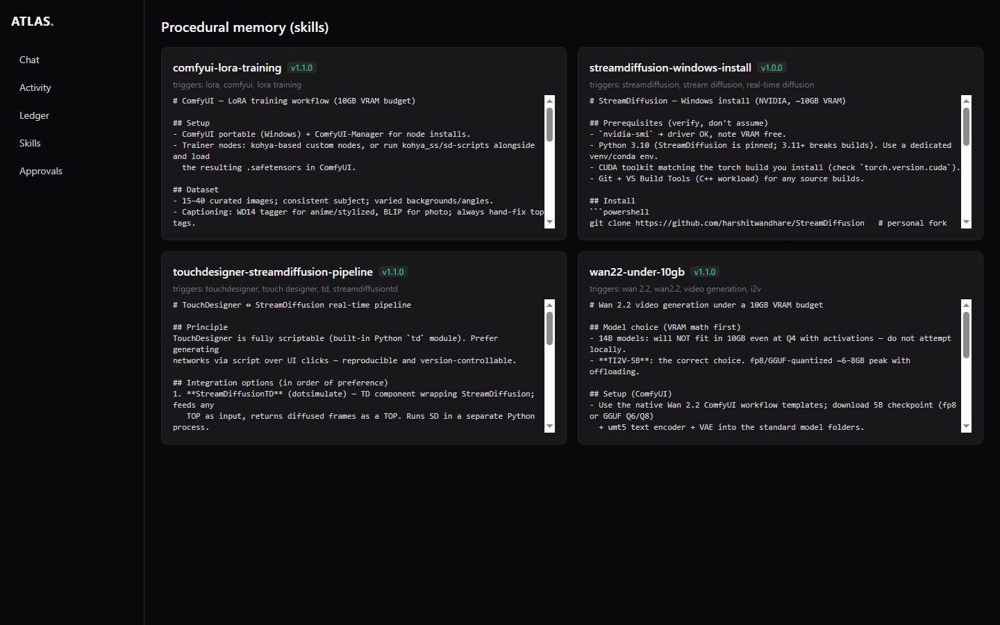 | 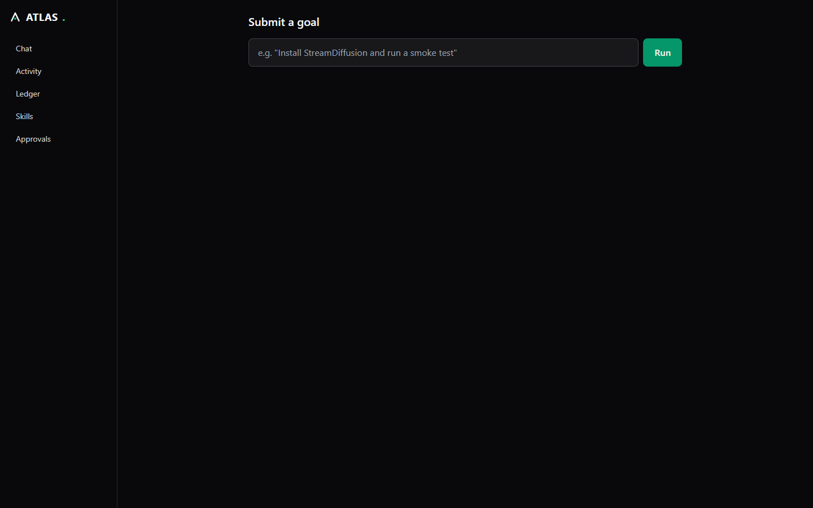 |

The activity capture shows one complete live lifecycle: `running` → the local
model's `message_delta` (its answer opens with the injected TouchDesigner-pipeline
skill content) → `review` → Critic approves → `done` with the result persisted.

## Why ATLAS exists

Frontier agents are powerful but stateless and unaccountable. ATLAS wraps a model-agnostic
agent core in the engineering that makes autonomy trustworthy:

- **Multi-team orchestration**: the `Orchestrator` keyword-routes each goal to a team
  (`systems`, `research`, `ops`), runs it against the configured provider, and retries with
  reviewer feedback on failure.
- **Three-tier memory**: episodic (SQLite task ledger), semantic (keyword-overlap store
  today, LanceDB-shaped interface for a drop-in vector backend), and procedural (versioned
  markdown skill playbooks matched by trigger keywords).
- **Tiered, approval-gated execution**: tools declare a tier (API → CLI → browser → screen)
  and a risk class; `destructive`-risk tools are routed through an `ApprovalQueue` and never
  execute without a human decision from the dashboard. Tiers 1 and 2 have registered tools
  today; browser and screen are roadmap (see [the audit](docs/REQUIREMENTS_AUDIT.md)).
- **Verification before completion**: a `Critic` reviews the run transcript and returns
  `approve` / `revise`; the orchestrator only marks a task `DONE` on approval.
- **Provider abstraction**: `AgentProvider` is a `Protocol` with three implementations
  (Claude Agent SDK, LangGraph, Ollama) selected at runtime via `ATLAS_PROVIDER`.
- **Live observability**: every normalized `AgentEvent` is persisted to the ledger, wrapped
  in an OpenTelemetry span, and fanned out over WebSocket to the dashboard.

## Architecture

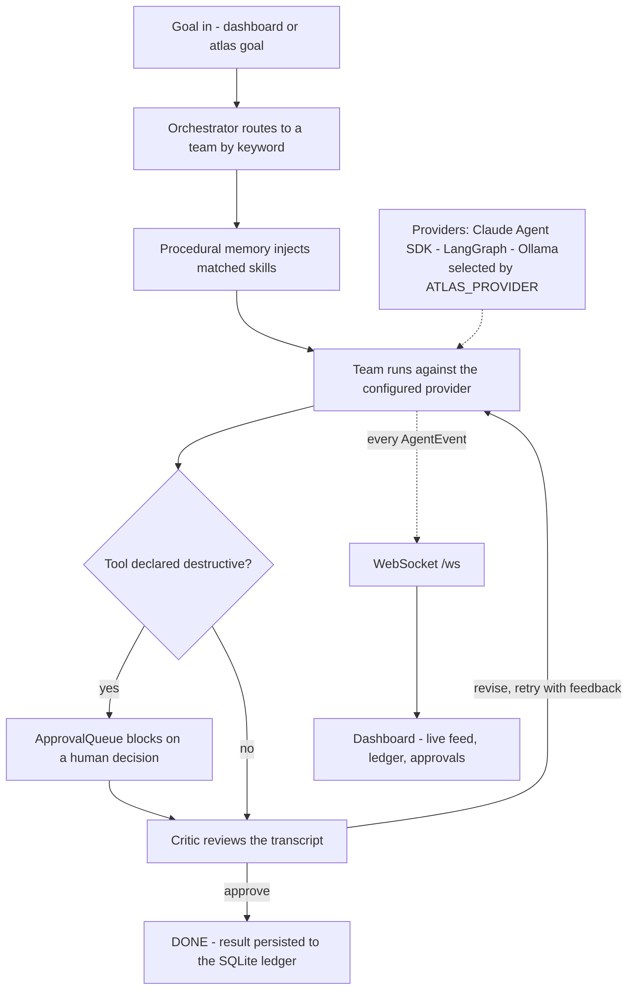
```mermaid
flowchart TB
    Goal["Goal in - dashboard or atlas goal"] --> Route["Orchestrator routes to a team by keyword"]
    Route --> Skills["Procedural memory injects matched skills"]
    Skills --> Run["Team runs against the configured provider"]
    Run --> Gate{"Tool declared destructive?"}
    Gate -- "yes" --> Queue["ApprovalQueue blocks on a human decision"]
    Gate -- "no" --> Critic
    Queue --> Critic["Critic reviews the transcript"]
    Critic -- "revise, retry with feedback" --> Run
    Critic -- "approve" --> Done["DONE - result persisted to the SQLite ledger"]

    Run -. "every AgentEvent" .-> Bus["WebSocket /ws"]
    Bus --> Dash["Dashboard - live feed, ledger, approvals"]

    Providers["Providers: Claude Agent SDK - LangGraph - Ollama<br/>selected by ATLAS_PROVIDER"] -.-> Run
```

See [docs/ARCHITECTURE.md](docs/ARCHITECTURE.md) for the full task lifecycle, memory
read/write paths, and execution-tier policy, and [docs/DATA_MODELS.md](docs/DATA_MODELS.md)
for every data model in the system. Design rationale lives in [docs/adr/](docs/adr/).
Operating manual: [docs/OPERATIONS.md](docs/OPERATIONS.md). Version pins:
[docs/VERSIONS.md](docs/VERSIONS.md). Honest brief-vs-built mapping:
[docs/REQUIREMENTS_AUDIT.md](docs/REQUIREMENTS_AUDIT.md).

## RA workloads

The lab work this system assists with ships in-repo, ready to load:

- [`workflows/comfyui/`](workflows/comfyui/): Wan 2.2 5B image-to-video within a
  10 GB VRAM budget, and LoRA training on ComfyUI's native `TrainLoraNode` (no custom
  nodes). Model tables and OOM fallbacks in the local README.
- [`workflows/touchdesigner/`](workflows/touchdesigner/): operating TouchDesigner
  against the local StreamDiffusion install (OSC-controlled PNG/NDI bridges, benchmarked).
- [`scripts/launch_streamdiffusion_demo.ps1`](scripts/launch_streamdiffusion_demo.ps1)
  is a one-command launcher for the StreamDiffusion backend (td | web | screen modes).

## Module map

Verified against source. Nothing here is aspirational.

| Module | What it actually does |
|---|---|
| `atlas.orchestrator.core` | `Orchestrator`: creates a task in the ledger, keyword-routes it to a team, runs the provider loop, retries on failure (`settings.max_retries`), requests Critic review, transitions task state. |
| `atlas.providers.base` | `AgentProvider` protocol. `run(task_id, system_prompt, goal, tools, context) -> AsyncIterator[AgentEvent]`. The only surface the rest of the system may depend on. |
| `atlas.providers.claude` | Reference provider wrapping `claude_agent_sdk.query()`; normalizes SDK message blocks into `MESSAGE_DELTA` / `TOOL_CALL` events. |
| `atlas.providers.langgraph` | Builds a `langgraph.prebuilt.create_react_agent` graph; optional dependency, imported lazily. |
| `atlas.providers.ollama` | Zero-dependency HTTP client against a local Ollama server (`/api/generate`); non-streaming. |
| `atlas.providers.registry` | `get_provider(name)`: string-keyed lookup selected via `ATLAS_PROVIDER` config. |
| `atlas.teams.systems` / `.research` / `.ops` | Static system prompts + declared tool/tier/risk lists per team. No team-specific Python logic beyond the prompt. |
| `atlas.teams.critic` | `Critic.review(goal, transcript)`: heuristic reviewer today (rejects empty transcripts and transcripts ending in "error"); interface is provider-swappable. |
| `atlas.memory.episodic` | `Ledger`: SQLite-backed `tasks` / `steps` tables; `create_task`, `set_state`, `log_step`, `get_task`, `list_tasks`. |
| `atlas.memory.semantic` | `SemanticStore`: JSONL-backed keyword-overlap search (`Doc`, `add`, `search`); same interface a LanceDB backend would implement. |
| `atlas.memory.procedural` | `SkillStore`: parses front-matter markdown in `skills/*.md` into `Skill` objects; `match(goal)` returns skills whose triggers substring-match the goal. |
| `atlas.executors.registry` | `ToolRegistry` + `Tool` dataclass (name, tier, risk, handler). `execute()` routes `Risk.DESTRUCTIVE` tools through an `ApprovalQueue` before running the handler. Ships `run_python`, `run_powershell`, `delete_path`. |
| `atlas.executors.approvals` | `ApprovalQueue`: in-process pending/approved/denied request store with `asyncio.Event`-based waiting and an optional notifier callback. |
| `atlas.comms.email_adapter` | `EmailAdapter` protocol + `ImapAdapter` reference implementation (IMAP fetch, SMTP send, credentials via `keyring`). |
| `atlas.comms.email_watcher` | `EmailWatcher`: regex-based action-item extraction from unread mail; `send_reply()` always parks the draft in `ApprovalQueue` before `adapter.send()`, and no direct-send path exists in code. |
| `atlas.comms.notify` | `TelegramNotifier`: fire-and-forget Telegram `sendMessage` call, swallows failures so notification errors never break the pipeline. |
| `atlas.ingest.pipeline` | `ingest(source, store)`: format-dispatch table (`.pdf`, `.pptx`, `.docx`, `.txt/.md/.srt/.vtt`) plus `fetch_video_transcript()` via `yt-dlp`; degrades to an "install X" string when an optional dependency is missing. |
| `atlas.ingest.procedures` | `extract_procedure(text)`: regex-based imperative-sentence extractor that turns a transcript into a draft skill playbook (never auto-promoted). |
| `atlas.observability.tracing` | `traced_event()` context manager that wraps each event in an OpenTelemetry span, and no-ops if the SDK isn't configured. |
| `atlas.api.main` | FastAPI app: `POST /goals`, `GET/POST /tasks`, `GET /skills`, `GET/POST /approvals`, `POST /ingest`, `WS /ws`. `Bus` fans out `AgentEvent`s to connected dashboard clients. |
| `atlas.cli` | Typer CLI: `atlas serve`, `atlas goal "…"` (submit to a running server), `atlas tasks` (ledger table), `atlas version`. |
| `frontend/app/(site)/page.tsx` | Public landing page: what ATLAS is, the task lifecycle, the layer diagram, and the engineering behind it. Static, no API dependency. |
| `frontend/lib/demo.ts` | Sample tasks/skills/approvals/events served when no backend is reachable, so the hosted preview is not a set of empty screens. Timestamps derive from a fixed base so SSR and client markup match. |
| `frontend/components/DemoBanner.tsx` | Preview notice: renders only in the fallback state, states that the data is illustrative and that controls are inert. |
| `frontend/app/(app)/console/page.tsx` | Goal submission: `POST /goals`, then filters the live WebSocket event stream to that task. |
| `frontend/app/(app)/activity/page.tsx` | Raw live event feed (all tasks) from `useEvents()`. |
| `frontend/app/(app)/ledger/page.tsx` | Polls `GET /tasks` every 3s, renders the task table with state coloring. |
| `frontend/app/(app)/skills/page.tsx` | Renders `GET /skills` as playbook cards. |
| `frontend/app/(app)/approvals/page.tsx` | Polls `GET /approvals` every 2.5s; Approve/Deny buttons call `POST /approvals/{id}`. |
| `frontend/lib/api.ts` | Typed fetch wrappers + shared `Task` / `AgentEvent` / `Skill` / `Approval` interfaces. `withFallback()` serves sample data when the API is unreachable and publishes that state to subscribers. |
| `frontend/lib/useEvents.ts` | WebSocket hook with exponential-backoff reconnect, keeps the last N events. |

## Quickstart

```bash
# Backend: Python 3.10+, uv (or plain venv + pip)
cd backend
uv sync --all-extras                 # or: python -m venv .venv && pip install -e ".[dev]"
cp .env.example .env                 # pick a provider: claude (needs Claude Code signed in)
                                     # or ollama (fully local: ATLAS_PROVIDER=ollama)
uv run atlas serve                   # FastAPI + orchestrator on :8000
uv run atlas goal "Summarize how to fit Wan 2.2 in a 10GB VRAM budget"
uv run atlas tasks                   # watch it move: running -> review -> done

# Frontend: Node 20
cd ../frontend
npm install
npm run dev                          # dashboard on :3000
```

Run the test suite and evals the same way CI does:

```bash
cd backend
uv run ruff check .
uv run mypy src
uv run pytest -q
uv run python -m evals.run_evals
```

## CI / quality gates

Every push and pull request to `main` runs the full matrix below. All actions are pinned
by commit SHA (a tag can be moved to point at new code, a SHA cannot) and Dependabot's
`github-actions` ecosystem keeps those pins current.

| Gate | What runs |
|---|---|
| Lint & Format | `ruff check` + `ruff format --check` |
| Type Check | `mypy --strict` across the backend |
| Test | `pytest` on Python 3.10, 3.11, and 3.12 |
| Evals | `evals.run_evals`: scored regression tasks, must clear the baseline |
| Secret Scan | `gitleaks` over full history |
| Supply Chain | `pip-audit` for known CVEs + licence check (fails on GPL/AGPL/SSPL) |
| Web | `next lint` → `tsc --noEmit` → `next build` |
| Web Supply Chain | `npm audit --audit-level=high` on shipped dependencies |

Three more run on their own schedules:

| Workflow | Cadence |
|---|---|
| `codeql.yml` | Every push/PR plus a weekly deep scan, Python and TypeScript, `security-and-quality` queries |
| `scorecard.yml` | Weekly OpenSSF Scorecard, results published to code scanning |
| `security-scan.yml` | Every third day: secrets and dependency audits, independent of PR traffic |

The web audit is scoped with `--omit=dev`. Two high-severity advisories remain in the dev
tree (`image-size`, reachable only through `@storybook/nextjs`) and have no fixed release
upstream; gating on them would mean a permanently red build nobody can turn green. Runtime
dependencies are gated strictly.

`.github/workflows/deploy.yml` deploys `frontend/` to Vercel on push to `main` (gated
behind `VERCEL_TOKEN` / `VERCEL_ORG_ID` / `VERCEL_PROJECT_ID` repo secrets. See the
workflow file for one-time setup notes).

## Tech stack

| Layer | Choice |
|---|---|
| Backend framework | FastAPI + uvicorn, Pydantic v2 / pydantic-settings |
| Agent runtime | Claude Agent SDK (reference), LangGraph, Ollama, all behind `AgentProvider` |
| Episodic memory | SQLite (stdlib `sqlite3`) |
| Semantic memory | Keyword-overlap store (JSONL); LanceDB-shaped interface |
| Procedural memory | Git-versioned markdown in `skills/`, front-matter parsed |
| Observability | OpenTelemetry API/SDK, optional OTLP export |
| Package/lint/type | uv, ruff, mypy (strict) |
| Testing | pytest, pytest-asyncio |
| Frontend | Next.js 15 (App Router), TypeScript, Tailwind CSS |
| Realtime | Native WebSocket (`/ws`), reconnect with backoff |
| CI/CD | GitHub Actions (`ci.yml`, `deploy.yml`), Vercel |

## Repository layout

```
backend/    Typed Python package (uv, ruff, mypy, pytest): orchestrator, providers,
            teams, memory, executors, comms, ingest, api
frontend/   Next.js 15 dashboard (App Router, Tailwind, WebSocket client), Storybook
skills/     Procedural memory: versioned playbooks the system learns and uses
docs/       Architecture, data models, ADRs, roadmap
```

## Safety model

Destructive actions (file deletion, system changes, outbound email) are declared with
`Risk.DESTRUCTIVE` in the tool registry, and the registry, not the prompt, forces them
through `ApprovalQueue` before executing. All task steps are logged to the
episodic ledger (SQLite) for audit. Secrets are read from environment / OS keyring,
never committed (`backend/.env.example` documents the required variables; `.env` is
git-ignored).

## License

MIT © Harshit Wandhare
